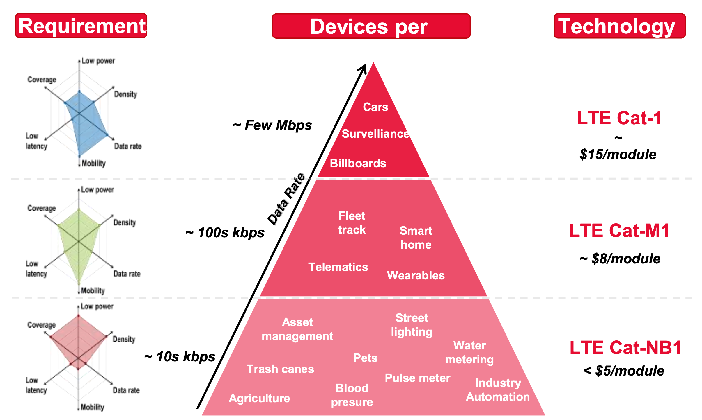
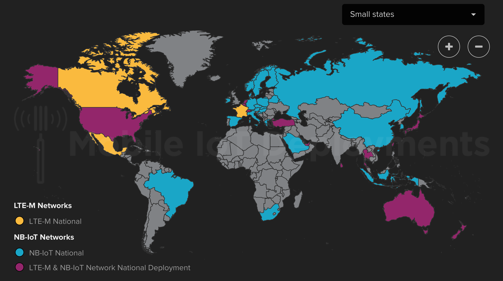

# Indoor IoT Connectivity, Part 1

At ParkBee we're experimenting with the new Internet-of-Things (IoT) network that is being deployed slowly but surely around the world. These two technologies are known as Narrowband IoT (**Nb-IoT, henceforth**) and LTE Cat M1 / LTE-MTC (**LTE-M, henceforth**).

The reasons for our testing are quite simple: as we're trying to push our solution into more unused spaces around the Netherlands and Europe, the need for deploying to more exotic locations is becoming greater and greater. These two new technologies allow for deployments into harder-to-reach, indoor locations.

The solution up to this point for machine-to-machine (M2M) communication has been the 2G / GSM network. While slower than its descendants 3G and 4G, 2G has become standard because it offers more widespread connectivity indoors, and [saves battery life](https://www.quora.com/Which-consumes-more-battery-2G-3G-or-4G) for sensoring applications where battery replacement is difficult. 

## Population Explosion

There does seem to be a gluttony of cellular network technologies, and thus, an equivalent amount of acryonyms floating around the Internet. Here's the quick and dirty version of what you need to know:

- 2G and 3G networks worldwide are [gradually being shutdown](https://1ot.mobi/blog/2g-and-3g-networks-are-shutting-down-globally) in favor of 4G / LTE / 5G networks. These will be the preferred networks for high-bandwidth applications like smartphones where preservation of battery life is not crucial.
- Nb-IoT and LTE-M eventually hope to replace older 2G / 3G networks for M2M communication. They are both part of existing, licensed spectrums.
- The three technologies (4G / 5G, LTE-M, and Nb-IoT) represent the trade-off between high-data / low battery (4G / 5G), and low-data / high-battery (Nb-IoT) networks.

The following diagram from Keysight Technologies' article [CAT-M & NB-IoT Design and Conformance Test](https://www.keysight.com/upload/cmc_upload/All/20170612-A4-JianHuaWu-updated.pdf) represents the last point very well:

## Nb-IoT vs. LTE-M

The two M2M networks have their own similarities and differences.

**Similarities**:

- Both designed for many more devices per base station. This translates into being able to deploy massive amounts of sensors, or fleet tracking devices that have guaranteed connectivity.
- Very low power consumption
- Wider coverage than normal 4G / 5G networks

**Differences** [^differencesfootnote]:

[^differencesfootnote]: https://www.qorvo.com/design-hub/blog/how-nb-iot-and-lte-m-fit-into-iot-ecosystem-future-of-cellular-iot

- LTE-M employs the full TCP/IP stack, whereas Nb-IoT currently only supports the UDP protocol
- LTE-M is based on existing LTE specifications, and more easily deployed, whereas Nb-IoT is easier for operators with GSM networks to incorporate.
- Nb-IoT generally is better for devices where lower-data, higher-battery life is required.

## Current Worldwide Deployment

The availability of these two networks is entirely dependent on the telecom companies in each respective country. For example, The Netherlands and Belgium are both quite progressive in its deployment, having both Nb-IoT and LTE-M networks deployed nationally. Our other location in the UK still does not have either spectrum deployed as of now; [trials for these two technologies began in mid-2017](https://www.theregister.co.uk/2017/05/22/o2_iot_connectivity_trials_uk/).

For the most up to date map, check out the GSMA website here: https://www.gsma.com/iot/deployment-map/#deployments. We're hoping that the UK delivers on its promise to deploy these networks in 2019.

If you're looking for providers of SIM cards in The Netherlands, the following companies offer great packages for 4G / LTE-M bundles:

- [SIM Services](https://www.simservices.com/)
- [SIM Point](https://www.simpoint.com/en/)

Other notable mentions are [Hologram](https://hologram.io/) and [Twilio](https://www.twilio.com/wireless), but coverage in Europe should be taken on a case-by-case basis, and I'm not sure if they have LTE-M / Nb-IoT offerings.

## Future Testing for Part 2

Currently we're experimenting with two LTE-M based routers:

- [Robustel R2000-LTE-M](https://www.delmation.nl/product/lte-m-router-met-2x-lan/)
- [Sierra Wireless AirLink LX60](https://www.sierrawireless.com/products-and-solutions/routers-gateways/lx60/)

More to come in Part 2.

## About ParkBee

I work for Parkbee. We develop smart tech. Our Mobility Management Solution optimizes the use of underutilized parking space to get cars off the street and [KEEP YOUR CITY MOVING](https://keepyourcitymoving.com/).

Check out [Parkbee’s Careers Site](https://careers.parkbee.com/) (we’re hiring!), or follow our [@lifeatparkbee](http://instagram.com/lifeatparkbee) Instagram account.